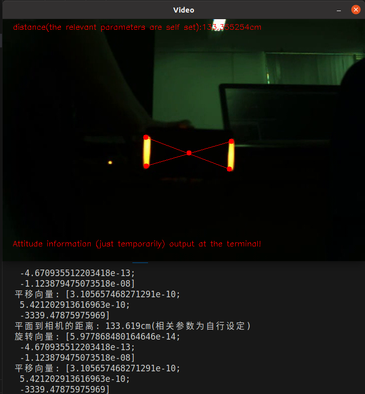

实习生姓名：于浩林

# 装甲板识别

## 代码思路

1. 包含了必要的OpenCV库和其他标准C++库。

2. 使用`VideoCapture`打开了指定路径下的视频文件"/home/taylor/testcpp/24-vision-yhl-1/rectangle/rec.avi"。如果无法打开视频文件，则显示错误消息并退出。

3. 使用`VideoWriter`设置了一个输出视频文件，文件名为"output_video.avi"。视频使用XVID编解码器进行编码，并以每秒30帧的帧率进行保存。

4. 进入循环以处理视频的每一帧。

5. 在循环内部，使用`cap >> frame`从视频中读取一帧。

6. 对帧应用计算机视觉操作：

   - 使用`cvtColor`将帧从BGR颜色空间转换为HSV颜色空间。
   - 定义了HSV颜色空间中黄色的颜色范围。
   - 创建一个掩码以隔离帧中的黄色区域。
   - 使用形态学操作来消除掩码中的噪声。

7. 使用霍夫线变换（被注释掉）来检测掩码中的黄色线条。标记为“失败”。

8. 使用`findContours`在黄色掩码中查找轮廓。仅考虑面积大于100像素的轮廓。

9. 计算检测到轮廓的平均中心。

10. 找到每个有效轮廓内的顶部和底部点，并将它们添加到`extremepoints`向量中。

11. 使用检测到的`extremepoints`的大小和相机参数计算深度（从相机到对象的距离）。

12. 使用`solvePnP`计算相机坐标系中的`extremepoints`的三维坐标。

13. 在终端中显示计算得到的深度、旋转向量和平移向量。

14. 在帧中绘制连接每个轮廓的顶部和底部点的线。

15. 计算为补偿重力需要的发射仰角。

16. 使用`putText`在帧上显示信息。

17. 将处理过的帧写入输出视频。

18. 检查用户是否按下ESC键，如果按下ESC键，则退出循环。

19. 在处理所有帧后，释放视频捕获和视频写入对象，并关闭所有OpenCV窗口。

## 遇到的问题及解决思路

1. **视频文件路径问题**：
   - 问题：代码中指定了视频文件的路径为`"/home/taylor/testcpp/24-vision-yhl-1/rectangle/rec.avi"`，这个路径在不同系统上可能不同，或者文件可能不存在。
   - 解决思路：确保视频文件的路径是正确的，并且文件存在。可以使用相对路径传递视频文件路径，以便更灵活地处理不同的文件。

2. **黄色线条检测问题**：
   - 问题：代码中使用Hough Line Transform来检测黄色线条，但这部分被注释掉，并且标记为“失败”。
   - 解决思路：如果需要检测黄色线条，可以尝试调整Hough变换的参数，如阈值、最小线段长度和最大间隔等，以获得更好的检测结果。也可以考虑使用其他线条检测算法或颜色检测方法。（因为可能用不上，所以没有继续深入研究,最终选用了其他检测方法）

3. **姿态问题**：
   - 问题：姿态如何表示。
   - 解决思路：经查有众多姿态表示方法，部分涉及较复杂的数学知识。通过`solvepnp`函数解算的相机坐标系到世界坐标系的旋转向量和平移向量可以成为姿态解算最重要的数据之一。

## 效果图



# SSH 操作总结

SSH（Secure Shell）是一种用于安全远程管理和文件传输的协议。它提供了加密的通信通道，允许连接到远程服务器并执行各种操作。本文档基于模板自行编写。

## 连接到远程服务器

要连接到远程服务器，可以使用以下命令：

```bash
ssh username@remote_server_ip
```

- `username` 是您在远程服务器上的用户名。
- `remote_server_ip` 是远程服务器的IP地址或域名。


## 远程创建文档

使用SSH连接到远程服务器后，可以使用各种命令来创建文档。

- 创建一个新文件：

```bash
touch filename.txt
```

- 使用文本编辑器创建或编辑文件（例如，使用nano或vim）：

```bash
vim filename.txt
```

## 配置密钥对

为了增强SSH连接的安全性，可以配置密钥对。这包括生成一对公钥和私钥，将公钥上传到远程服务器，然后在本地使用私钥进行身份验证。

### 生成密钥对

使用以下命令生成SSH密钥对：

```bash
ssh-keygen -t rsa -b 2048
```

- `-t` 指定密钥类型（此处使用RSA）。
- `-b` 指定密钥位数（2048位通常足够安全）。

### 上传公钥到远程服务器

使用以下命令将公钥上传到远程服务器（假设已经连接到服务器）：

```bash
ssh-copy-id username@remote_server_ip
```

这将自动将公钥添加到远程服务器的`~/.ssh/authorized_keys`文件中。

### 使用密钥进行身份验证

在配置密钥对后，可以使用私钥进行SSH连接，而无需输入密码：

```bash
ssh -i /path/to/private/key username@remote_server_ip
```

## 拷贝文件到另一台电脑

可以使用`scp`命令将文件从本地计算机复制到远程服务器，或者从远程服务器复制文件到本地计算机。

- 从本地计算机复制文件到远程服务器：

```bash
scp /path/to/local/file username@remote_server_ip:/path/to/remote/directory
```

- 从远程服务器复制文件到本地计算机：

```bash
scp username@remote_server_ip:/path/to/remote/file /path/to/local/directory
```

SSH是一个功能强大且安全的工具，可以在远程服务器上执行各种操作，同时保护数据的安全性。通过了解这些基本操作，可以更有效地使用SSH来管理远程服务器和文件。

# 神经网络学习笔记

## 1. 基础概念

### 目标检测

目标检测是计算机视觉领域中的关键任务，其目标是从图像或视频中准确地识别和定位物体。

- **边界框**：边界框是用于框定目标位置的矩形框。通常由四个坐标值表示，分别是左上角和右下角的坐标。
- **锚点框**：锚点框是用于检测不同尺寸和宽高比目标的预定义框。模型可以选择使用哪个锚点框以匹配目标的大小。
- **类别预测**：目标检测不仅要定位目标，还要预测目标所属的类别。通常使用softmax函数对不同类别进行概率预测。

### YOLOX基本概念

YOLOX（You Only Look Once X）是YOLO目标检测系列的新版本，具有高效性和出色的性能。

- **YOLOX架构**：YOLOX采用了一种单阶段的目标检测方法，将目标检测任务分解为一次前向传播。这使得YOLOX在速度和精度之间取得了很好的平衡。
- **Darknet53骨干网络**：YOLOX使用Darknet53作为骨干网络，用于提取图像特征。这个骨干网络帮助模型理解图像的上下文信息。
- **FPN（Feature Pyramid Network）**：FPN用于合并不同尺度的特征图，以便检测不同尺寸的目标。
- **YOLOX头部**：YOLOX头部是网络的最后一部分，负责生成边界框、类别预测和置信度得分。

## 2. 深度学习基础

### 神经网络

神经网络是深度学习的基础，用于构建复杂的模型。它的工作方式受到生物神经元系统的启发，通过一系列的层次结构（神经元）来学习从输入到输出的映射。这些神经元之间的连接具有权重，它们会通过学习从数据中调整这些权重，从而使网络能够自动提取特征和模式。

- **前馈传播**：神经网络是前馈传播的，意味着数据从输入层经过一系列中间层传递，最终得到输出。
- **反向传播**：通过反向传播算法，网络能够根据预测和真实标签之间的差异来调整权重，从而不断改进模型的性能。
- **隐藏层**：神经网络通常包括多个隐藏层，每个隐藏层都包含多个神经元，这些隐藏层负责处理不同级别的特征。

### 卷积神经网络（CNN）

卷积神经网络是神经网络的一种变体，特别适用于图像处理任务。CNN以图像的局部感知为基础，通过卷积层、池化层等结构来有效地提取图像中的特征。

- **卷积层**：卷积操作用于检测图像中的特定模式，例如边缘、纹理等。
- **池化层**：池化层用于减小特征图的尺寸，减少计算量，同时保留最重要的特征。
- **多层结构**：CNN通常由多个卷积层和全连接层组成，逐渐提取和组合图像中的抽象特征。

### PyTorch

PyTorch是一个流行的深度学习框架，用于实现和训练神经网络模型，包括YOLOX。

- **张量**：PyTorch使用张量作为主要的数据结构，它们类似于NumPy数组，但可以在GPU上运行，加速计算。
- **自动微分**：PyTorch提供了自动微分功能，可以轻松地计算梯度，用于反向传播和权重更新。

## 3. 数据集


### 数据集选择

在开始进行目标检测项目之前，首先要选择一个合适的数据集，以确保模型能够学习各种目标的外观和上下文信息。数据集的选择直接影响模型的性能和泛化能力，不同数据集具有不同的特点，因此选择适当的数据集对于项目的成功至关重要。一些关键点包括：

- **数据集类型**：选择数据集的第一步是确定任务类型，每种任务需要不同类型的数据集。

- **数据量和多样性**：数据集应具有足够的多样性，大型数据集通常更适合深度学习任务。

### 数据预处理：

数据预处理是为了将原始数据转化为适合模型输入的格式，同时提供有关数据的有用信息。数据预处理可以帮助模型更好地理解图像，提高模型的鲁棒性和泛化能力。

- **尺寸调整**：将图像调整为相同的尺寸，以确保输入到模型的图像具有一致的大小。这通常包括缩放和裁剪。

- **归一化**：对图像进行归一化，将像素值映射到固定的范围，通常是[0, 1]或[-1, 1]，以便加速模型训练。

- **数据增强**：数据增强技术用于生成训练样本的变化版本，增加数据的多样性。这包括旋转、翻转、平移、亮度和对比度调整等。


## 4. 模型训练


### 数据准备：

- **数据加载**：数据加载包括读取图像和相关标签。

- **数据转换**：数据转换包括将图像和标签转化为模型所需的张量格式，这通常包括图像归一化和标签编码。

- **数据增强**：数据增强技术可用于在训练期间增加数据的多样性，包括旋转、翻转、缩放和随机裁剪等。

- **数据划分**：数据通常需要分为训练集、验证集和测试集，以便对模型的性能进行评估和调优。


### 超参数：

超参数是控制模型训练过程的关键参数，它们需要根据具体任务进行调整，以获得最佳的模型性能。

- **批大小**：批大小决定了每个训练步骤中用于模型更新的图像数量。较大的批大小可以加快训练速度，但需要更多的内存。较小的批大小可能有助于模型泛化。

- **学习率**：学习率是用于权重更新的步长，它直接影响了模型的收敛速度。太大的学习率可能导致不稳定的训练，而太小的学习率可能导致训练过慢。

- **正则化参数**：正则化参数用于控制模型的复杂性，以防止过拟合。

- **优化器**：选择适当的优化算法，以更好地调整模型权重。


### 损失函数：

在目标检测中，损失函数是用于衡量模型预测与真实标签之间差异的指标，它用于指导模型权重的调整。

- **边界框回归损失**：用于测量预测边界框与真实边界框之间的差异。

- **分类损失**：用于测量预测类别标签与真实类别标签之间的差异。

- **置信度损失**：用于衡量模型对目标存在的置信度。


### 训练过程：

- **初始化**：模型需要进行适当的初始化，以便开始训练。通常，使用随机初始化或者通过迁移学习来初始化权重。

- **前向传播**：训练过程中，数据通过网络进行前向传播，生成预测结果。

- **反向传播**：通过反向传播算法，计算梯度，用于权重的更新。这是训练模型的关键步骤。

- **批处理训练**：训练通常以小批量数据为单位进行，以提高模型稳定性。

- **模型评估**：在训练过程中，需要定期评估模型在验证集上的性能，以便及时调整超参数和防止过拟合。

- **模型保存**：当模型达到满意的性能时，需要保存模型的权重以供后续推理使用。


## 5. 模型评估和性能调优

### 性能评估：

- **准确率**：准确率是分类问题中的重要性能指标，表示模型正确分类的样本比例。

- **召回率**：召回率是在目标检测任务中常用的指标，表示模型成功检测到的正例（目标）占所有正例的比例。

- **AP（平均精度）**：AP是一种用于目标检测的精度指标，它考虑了模型的精度和召回率。

- **混淆矩阵**：混淆矩阵是用于分类问题的工具，可用于计算准确率、召回率和F1分数等。

### 调优技巧：

- **迁移学习**：迁移学习是通过在一个任务上训练的模型权重来初始化另一个相关任务的模型，以提高性能和加速训练。

- **学习率调度**：动态调整学习率可以提高训练的稳定性和模型性能。常见的学习率调度策略包括学习率衰减。

- **正则化技巧**：正则化方法如L1和L2正则化可用于减少过拟合，提高模型泛化性能。


## 6. 部署和应用

- **模型格式**：选择适合部署的模型格式，如TensorFlow、ONNX或PyTorch模型。

- **推理引擎**：选择适合的推理引擎，例如TensorRT、OpenVINO，以在目标平台上执行模型推理。

- **部署平台**：选择部署的平台，可以是云端服务器、边缘设备、移动应用或嵌入式系统。

# 使用 YOLOX 目标检测网络并使用 TensorRT 部署到 C++ 的全流程

## 1. 安装必要的库和工具

首先，确保系统上安装了以下依赖项，库和工具：

- Python 3.8
- PyTorch
- YOLOX
- CUDA-11.8
- OpenCV_Python
- TensorRT
- CMake
- g++ 编译器
- torch2trt
- numpy
- torch>=1.7
- loguru
- tqdm
- torchvision
- thop
- ninja
- tabulate
- psutil
- tensorboard

## 2. 下载 YOLOX 预训练模型

从官方GitHub仓库下载基于Pytorch的YOLOX主要源代码和示例代码，此处选用`yolox_s.pth`预训练模型。

## 3. 验证安装

使用自带测试demo，在终端输入命令后输出如下图像：
```shell
python3 tools/demo.py image -f exps/default/yolox_s.py -c ./yolox_s.pth --path assets/dog.jpg --conf 0.3 --nms 0.65 --tsize 640 --save_result --device gpu
```


## 4. 制作数据集

数据集采用VOC数据集，原始数据集是Labelme标注的数据集。下载地址：https://download.csdn.net/download/hhhhhhhhhhwwwwwwwwww/14003627。运行脚本后分类整理得到成品数据集。   


## 5. 修改配置文件

该部分主要为修改源代码中类别数目及名称，数据集路径等。

## 6. 训练模型

基于预训练模型迁移学习，来训练自己的模型，使用命令行执行操作：
```shell
python3 tools/train.py -f exps/example/yolox_voc/yolox_voc_s.py -d 1 -b 4 --fp16  -c yolox_s.pth
```

## 7. 测试模型

类似于第五步，修改相关配置文件后使用命令行执行操作：
```shell
python3 tools/demo.py image -f exps/example/yolox_voc/yolox_voc_s.py -c YOLOX_outputs/yolox_voc_s/latest_ckpt.pth --path ./assets/aircraft_589.jpg --conf 0.3 --nms 0.65 --tsize 640 --save_result --device gpu
```

## 8. 转换模型

使用torch2trt可以很容易地将YOLOX模型转换为RensorRT。

   使用flag `-f` 来指定你的输出路径：
   ```shell
   python tools/trt.py -f <YOLOX_EXP_FILE> -c <YOLOX_CHECKPOINT>
   ```
转换后的模型和序列化引擎文件（用于C++）将保存在实验输出目录中。 

## 9. 编译 C++ 代码

使用 CMake 和 g++ 编译器来构建 C++ 代码，在CMakeLists.txt.中设置TensorRT和CUDA的路径，确保链接正确的 TensorRT 和其他依赖项。

因为是训练自己的数据集,需要更改 `num_class`的值。

```c++
const int num_class = 80;
```
编译：    
```shell
mkdir build
cd build
cmake ..
make
```

## 10. 运行 C++ 应用程序

运行官方提供的 C++ demo应用程序，它将加载优化的模型并执行目标检测。

```shell
./yolox ../model_trt.engine -i ../../../../assets/dog.jpg
```

or

```shell
./yolox <path/to/your/engine_file> -i <path/to/image>
```

# ROS 摄像头驱动节点

这个Python脚本实现了一个ROS节点，用于捕获来自摄像头的图像并将其发布到ROS话题。节点还发布了相机的参数信息（CameraInfo）。

## 功能

1. 初始化ROS节点。
2. 创建两个发布者，一个用于图像消息，另一个用于相机信息（CameraInfo）消息。
3. 使用OpenCV从摄像头中捕获图像。
4. 将捕获的图像转换为ROS图像消息格式。
5. 填充相机信息（CameraInfo）消息并发布它。
6. 持续运行并以指定的频率捕获和发布图像。

## 发布的主题

- 发布主题：
  - `/camera/image`：包含捕获图像的ROS消息。
  - `/camera/camera_info`：包含相机参数信息的ROS消息。

## 依赖库

- `rospy`: 用于ROS节点的初始化和发布器创建。
- `cv2`（OpenCV）：用于摄像头图像的捕获和转换。
- `sensor_msgs.msg.Image`：用于图像消息。
- `sensor_msgs.msg.CameraInfo`：用于相机信息消息。
- `cv_bridge`：用于在OpenCV图像和ROS图像消息之间进行转换。

## 遇到的问题和解决方法

- **摄像头连接问题**：摄像头打不开打不开打不开根本找不到摄像头！！！查了30多篇国内外相关报错的解决方案都没有解决，目前怀疑是硬件问题或者recovery模式下`V4L2`的问题。

- **动态重配置问题**：使用动态重配置，需要确保正确设置了动态重配置服务器（在注释中已注释，因为好像不需要，本来.cfg配置也没写好，服务器通信还没看）。

# 图像分类模型训练

这是一个用于图像分类模型训练的Python脚本。它使用PyTorch和一些常见的库来加载数据、定义模型、进行训练和验证。

## 准备所需的库和模块

- `torchutils`: 这是自定义的模块，用于包含一些工具函数。
- `torchvision`: 用于处理图像数据和预定义的深度学习模型。
- `os.path`: 用于处理文件路径。
- `os`: 用于操作文件系统。
- 其他标准Python库和模块。

## 超参数设置

在脚本中，有一些超参数设置，例如模型名称、图像输入大小、数据集路径、学习率、批量大小、轮数等等。这些超参数决定了训练过程的配置。

## 定义模型

脚本中定义了一个名为`SELFMODEL`的PyTorch模型，用于图像分类任务。该模型基于指定的预训练模型（如ResNet）创建，并修改了最后一层全连接层以适应所需的类别数目。

## 训练流程

训练流程包括以下步骤：

1. 加载训练数据集和验证数据集，并对其进行数据预处理。
2. 创建模型实例，设置损失函数和优化器。
3. 进行多个轮次的训练，包括前向传播、计算损失、反向传播和权重更新。
4. 逐个轮次更新训练指标，如损失、F1分数、召回率和准确率。
5. 在训练过程中，学习率可能会动态调整。
6. 保存在验证集上性能最佳的模型。

## 验证流程

验证流程与训练流程类似，但在验证集上进行前向传播和性能度量，而不进行权重更新，这可以评估模型的性能。

## 展示训练过程的曲线

脚本还包含一个用于绘制训练过程中准确率和损失的曲线的函数，有助于可视化训练进展和性能。

## 遇到的问题和解决方法

- **模型选择**：因网络问题无法通过`torchvision`自动下载选择适合任务的预训练模型，可在网络搜索云盘资源或其他镜像链接下载后从本地导入并做相应的修改（如pretrained）。

- **学习率和超参数**：模型性能不佳，调整学习率、批大小和其他超参数以获得最佳性能。

- **内存问题**：GPU无法分配出足够内存，根据计算资源，可能需要适当调整批大小和数据加载器。

# 图像分类模型推理

这个C++程序使用ONNX Runtime库执行图像分类模型的推理。它加载一个预训练的深度学习模型，并使用它来对输入图像进行分类，然后输出前5个可能的类别。

## 使用的库和模块

- **ONNX Runtime**: 用于加载和运行ONNX模型。
- **iostream**: 用于控制台输出。
- **Helpers.cpp**: 自定义函数，用于加载图像和标签。

## 输入数据

- **模型**: 定义了一个ONNX模型文件的路径，这是训练好的图像分类模型。
- **标签文件**: 包含了图像类别标签的文件的路径。
- **图像文件**: 需要进行分类的输入图像的文件路径。

## 推理过程

1. 创建ONNX Runtime的环境和运行选项。
2. 加载ONNX模型。
3. 加载标签文件，以便在最终输出中显示类别标签。
4. 加载输入图像。
5. 执行模型推理，将输入图像传递给模型，并获得输出结果。
6. 对输出结果进行排序，找到前5个可能的类别。
7. 输出前5个类别及其概率。

## 遇到的问题和解决方法

- **输入图像格式**: 更换模型后推理错误。确保输入图像是224x224的RGB图像，与模型期望的格式匹配。这要求在更换模型时需要关注更换模型训练过程中输入数据预处理方式与推理例程中的数据预处理方式是否相同。

- **运行环境问题**: 找不到头文件。确保已正确设置ONNX Runtime环境，包括CPU或GPU支持。由于采用预编译包安装，很多库和头文件被删减，导致代码写作空间有限，只能更改代码

- **Cmake异常处理**: 找不到package。包所在路径缺少`CMakecCnfig`等文件，在某不知名仓库的issue里找到代码补充。

- **依赖库**: 参考例程部分函数无效。参考例程版本较低，在新版本onnx中已经删除部分函数，需要自行修改代码。

# 3D 点云到图像坐标的转换

这是一个简单的C++程序，用于将3D点云数据投影到2D图像坐标中。它依赖于OpenCV库，用于读取CSV文件、进行矩阵操作以及图像生成。

## 代码思路

1. **CSV文件读取**: 通过`csv`函数，首先读取一系列CSV文件中的3D点云数据，并将其存储在`std::vector`中。

2. **图像初始化**: 初始化一个指定大小的图像，作为输出图像。在本例中，使用了2000x1300像素大小的白色背景图像。

3. **相机参数定义**: 定义了相机的内部参数、畸变参数和外部参数（旋转矩阵和平移矢量）。

4. **3D到2D转换**: 利用相机参数和3D点云数据，使用`cv::projectPoints`函数将世界坐标系的3D点云投影到像素坐标系的2D图像中。

5. **绘制点**: 遍历投影后的2D点，并在输出图像上绘制这些点。

6. **保存输出图像**: 最后，使用OpenCV的`cv::imwrite`函数将生成的图像保存为PNG文件。

## 编写过程遇到的问题和解决方法

### 1. CSV文件读取

**问题**: 如何将CSV格式文件存储的点云数据提取出来存储成三维点数组。

**解决方法**: 有很多关于CSV数据处理的开源库，可以高效地处理，但鉴于此处数据量较小，遂自行编写简单程序：在`csv`函数中，使用`getline(file0, line)`获取文件的每一行内容，再使用`istringstream`类接收，依据逗号分割数据。

### 2. 相机参数和3D点云数据

**问题**: 相机参数和3D点云数据必须准确匹配，否则会导致投影错误。

**解决方法**: 确保正确设置相机内部参数、畸变参数和外部参数，并确保3D点云数据是与相机坐标系匹配的。如果不匹配，需要进行坐标变换或调整参数。
理论上从外参矩阵可获取世界坐标系与相机坐标系相互变换的旋转矩阵（或旋转向量）和平移向量，通过OpenCV4提供的`cv::projectPoints`函数可以将世界坐标系的3D点云投影到像素坐标系，
返回值为像素坐标系下的各点的像素坐标。尝试对旋转矩阵求逆矩阵或平移向量求反向量，可能修正匹配问题。下面提供官方文档对`cv::projectPoints`函数的完整解释：
```
/** @brief Projects 3D points to an image plane.

@param objectPoints Array of object points, 3xN/Nx3 1-channel or 1xN/Nx1 3-channel (or
vector\<Point3f\> ), where N is the number of points in the view.
@param rvec Rotation vector. See Rodrigues for details.
@param tvec Translation vector.
@param cameraMatrix Camera matrix \f$A = \vecthreethree{f_x}{0}{c_x}{0}{f_y}{c_y}{0}{0}{_1}\f$ .
@param distCoeffs Input vector of distortion coefficients
\f$(k_1, k_2, p_1, p_2[, k_3[, k_4, k_5, k_6 [, s_1, s_2, s_3, s_4[, \tau_x, \tau_y]]]])\f$ of
4, 5, 8, 12 or 14 elements. If the vector is empty, the zero distortion coefficients are assumed.
@param imagePoints Output array of image points, 1xN/Nx1 2-channel, or
vector\<Point2f\> .
@param jacobian Optional output 2Nx(10+\<numDistCoeffs\>) jacobian matrix of derivatives of image
points with respect to components of the rotation vector, translation vector, focal lengths,
coordinates of the principal point and the distortion coefficients. In the old interface different
components of the jacobian are returned via different output parameters.
@param aspectRatio Optional "fixed aspect ratio" parameter. If the parameter is not 0, the
function assumes that the aspect ratio (*fx/fy*) is fixed and correspondingly adjusts the jacobian
matrix.

The function computes projections of 3D points to the image plane given intrinsic and extrinsic
camera parameters. Optionally, the function computes Jacobians - matrices of partial derivatives of
image points coordinates (as functions of all the input parameters) with respect to the particular
parameters, intrinsic and/or extrinsic. The Jacobians are used during the global optimization in
calibrateCamera, solvePnP, and stereoCalibrate . The function itself can also be used to compute a
re-projection error given the current intrinsic and extrinsic parameters.

@note By setting rvec=tvec=(0,0,0) or by setting cameraMatrix to a 3x3 identity matrix, or by
passing zero distortion coefficients, you can get various useful partial cases of the function. This
means that you can compute the distorted coordinates for a sparse set of points or apply a
perspective transformation (and also compute the derivatives) in the ideal zero-distortion setup.
 */
```
运行效果地址：

git仓库地址：
[GitHub仓库链接](https://github.com/fhfjsd1/24-vision-yhl.git "访问yhl的仓库")


